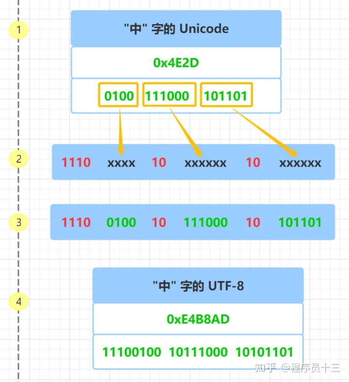
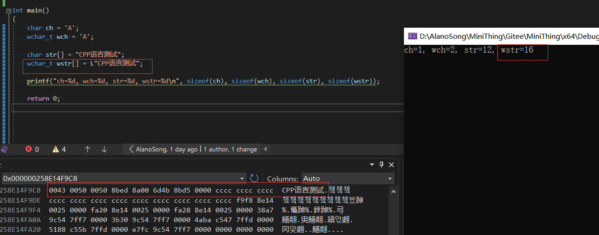
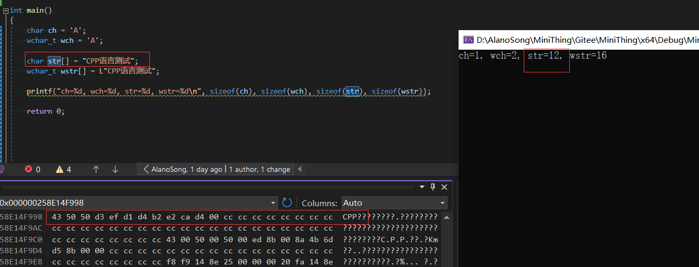

### Unicode字符集

- Unicode 是国际标准字符集，它将世界各种语言的每个字符定义一个唯一的编码，以满足跨语言、跨平台的文本信息转换
- Unicode 字符集的编码范围是 **0x0000 - 0x10FFFF** , 可以容纳一百多万个字符
- 每个字符都有一个独一无二的编码，也即每个字符都有一个二进制数值和它对应
- 这里的二进制数值也叫 **码点** , 比如：汉字 **"中"** 的 码点是  **0x4E2D** , 大写字母 **A** 的码点是 **0x41**

### 字符编码
- UTF-8、UTF-16、UTF-32
- UTF-8 最少需要8个比特位也就是一个字节来存储，对应的， UTF-16 和 UTF-32 分别需要最少 2 个字节 和 4 个字节来存储

### utf-8字符编码
- 一种变长字符编码，被定义为将码点编码为 1 至 4 个字节，具体取决于码点数值中有效二进制位的数量
- 对于单字节的符号，字节的第一位设为 0，后面 7 位为这个符号的 Unicode 码。因此对于英语字母，UTF-8 编码和 ASCII 码是相同的, 所以 UTF-8 能兼容 ASCII 编码，这也是互联网普遍采用 UTF-8 的原因之一
- 对于 n 字节的符号（ n > 1），第一个字节的前 n 位都设为 1，第 n + 1 位设为 0，后面字节的前两位一律设为 10 。剩下的没有提及的二进制位，全部为这个符号的 Unicode 码
- 例如汉字“中”，其Unicode字符集是`0x4E2D`，本身需要2个字节，再加上一些标志位，总共需要3个字节，其按照utf-8方式编码，如下过程：

- utf-16、utf-32不再赘述

### 编程中字符串前的L/_T是啥意思？

- 字符串前面加L表示该字符串是Unicode字符串
- _T是一个宏，如果项目使用了Unicode字符集（定义了UNICODE宏），则自动在字符串前面加上L，否则字符串不变

### 宽字符串的长度？

- 程序运行过程中，unicode每个字符占位2字节？（为什么不是按照之前提到的utf-8这种方式，占用2-3个字节？）
- 例如以下代码：

可以看到，因为wstr申明时加了L前缀，所以是宽字符，每个字符占位2个字节
- 而对于普通的字符串str

汉字部分变成了乱码，英文字符则是正常的ASCII格式，占位一个字符
- 计算普通字符串用strlen，计算宽字符串用wcslen

### string、wstring、char、wchar_t之间的相互转换

- create file用的LPCWSTR，wchar_t
- get volume用的LPCSTR，char
- usn info返回的是WCHAR，wchar_t
- 综合来看有以下几点：
> 1. 为了兼顾到各处兼容，内部存字符统一用wstring
> 2. 出现wchar_t直接赋值给wstring，需要用到wchar_t直接调用wstring的c_str()方法
> 3. 出现char转换到wchar_t，然后统一到wstring，需要用到char先确定是不是英文字符，是的话再转到char（应该只有打开目录这种情况，肯定是英文字符）
- 控制台显示wchar_t乱码：
> 
- 宽字符申明统一用_T，显得正式些
- sqlite存储宽字符
