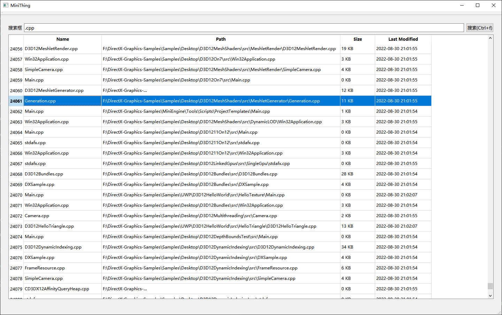

# MiniThing

## 1. Usage

- Start search: `ctrl+f` / `enter` / `search button2
- Open seleted file: `ctrl+o` / `right key`
- Open seleted file path: `ctrl+p` / `right key`
- Add more...

## 2. Build
- Enviroment: Visual Studio 2022 + QT 5.14.2
- VS config: Qt / CmdLine

## 3. To be added
- [x] Display more file info (include file name, path, size, last modified date)
- [ ] Add right key to open file or file location
- [ ] Perfermance enhance
- [ ] Fix bugs
- [ ] CMake build
- [ ] Graceful Qt UI

## 4. Participate in contributing
- Fork this repository
- Create a new Feature_xxx branch
- Submit the code
- Create a new pull request