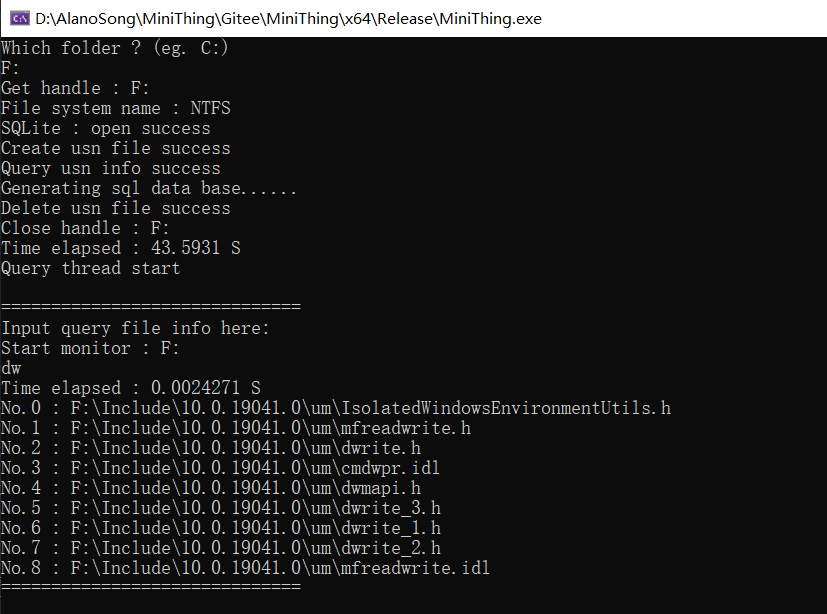
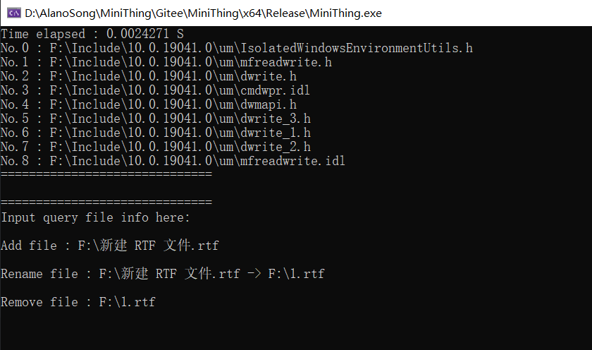

# MiniThing

#### 介绍
- Windows平台的Everything文件查找速度非常快，优势在于利用了NTFS的USN日志，以及Windows上的文件监测机制
- 这个项目仿照类似原理，通过查询USN日志、监测Windows平台文件修改、使用SQLite数据库存储文件节点，并提供文件信息查询功能

#### 如何使用
##### 编译
- Visual Studio：打开根目录下的MiniThing.sln，编译选择Build Solution，启动选择Local Windows Debugger
- CMake：待添加
##### 使用
- 目前仅支持命令行查找，程序启动后，输入要查询的盘符（eg."F:"）
- 第1次进入会建数据库，等待数据库建好之后，就能输入文件名进行查找

- 盘符下的文件改动也会被软件捕获到

- QT界面制作中...
- 正则查找等其他功能制作中...

#### 编写计划
- [x] 实现基本的USN日志查询，建立初始的文件节点数据库，存放在unordered map中
- [x] 开启monitor thread，后台监测文件改动
- [x] 研究unicode规范，解决代码中宽字符的处理问题
- [ ] 添加开源的日志打印，或者自写轻量级的打印宏
- [x] 研究sqlite接口，将数据库完全port到sqlite中
- [x] 开启query thread，实现命令行查询
- [ ] 用thread pool加速数据库初始化
- [ ] 基本bug清掉，代码结构优化
- [ ] 调查MFC、QT，选一个实现ui界面
- [ ] 整理输出相关文档

#### 性能测试
- 项目采用2种方式存储文件节点数据：stl库中的unordered_map和sqlite数据库
- 实测系统F:\盘，包含（文件\*5895，文件夹\*96）
- 采用unoreder_map，建立初始文件索引`26.6718 S`，单次查询`0.0220457 S`
- 采用sqlite数据库，建立初始文件索引`183.216 S`，单次查询`0.0044486 S`
- 显然***建立文件索引方面，unordered_map性能更优***，因为其数据驻留在内存中，查找和更新更快
- 而***文件查询方面，sqlite性能更优***，因为unordered_map需遍历所有数据，而sqlite数据库有专门优化
- 所以采取以下策略：***建立文件索引采用unordered_map，然后数据存储到sqlite，文件查询通过sqlite***
- 优化后，建立初始文件索引`44.4971 S`，单次查询`0.0018933 S`，可以看到整体有所优化

#### 参与贡献
- Fork 本仓库
- 新建 Feat_xxx 分支
- 提交代码
- 新建 Pull Request
