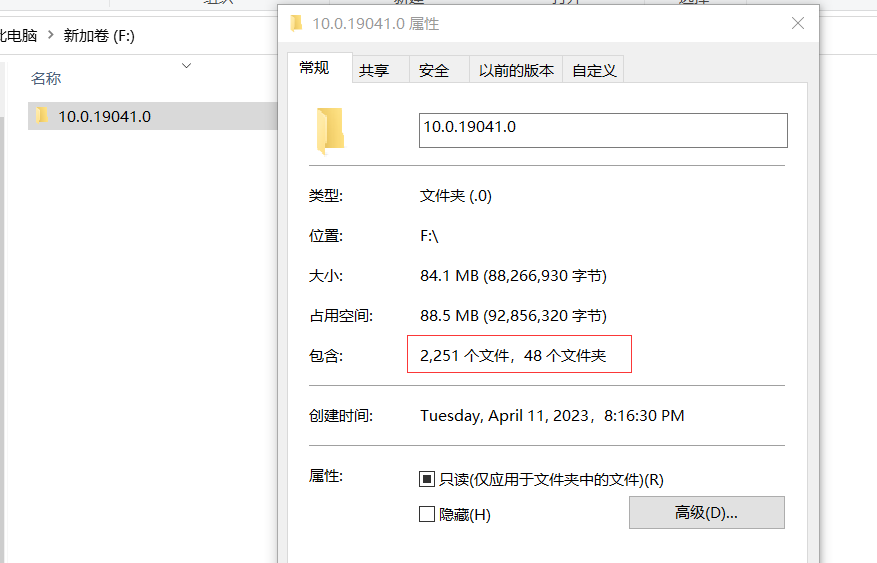
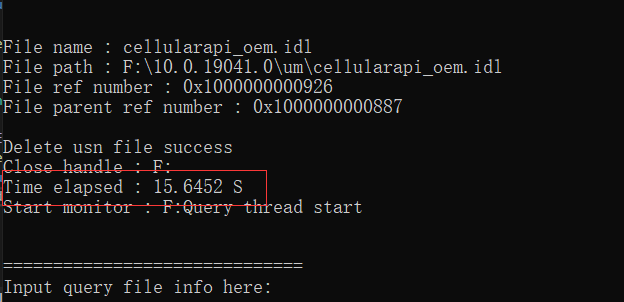
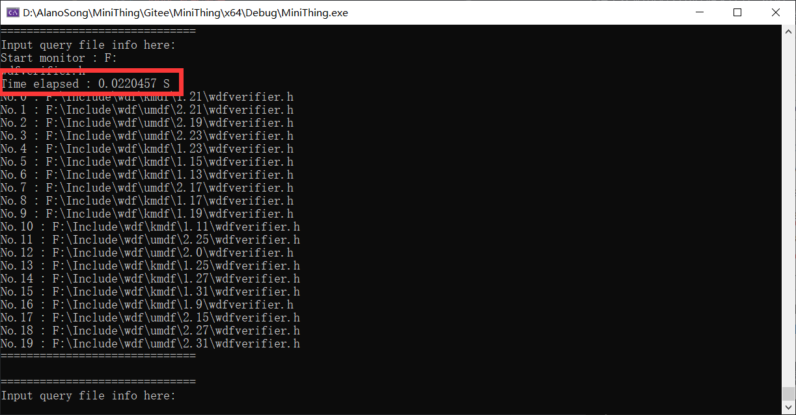

# MiniThing

#### 介绍
- Windows平台的Everything文件查找速度非常快，优势在于利用了NTFS的USN日志，以及Windows上的文件监测机制
- 这个项目仿照类似原理，通过查询USN日志、监测Windows平台文件修改、使用SQLite数据库存储文件节点，并提供文件信息查询功能

#### 编写计划
- [x] 实现基本的USN日志查询，建立初始的sqlite数据库
- [x] 开启monitor thread，检测系统文件改动
- [x] （2周）（2023/04/09）研究Unicode原理，彻底解决宽字符的打印、与常规字符转换、sqlite的存取问题（找找有没有相关的开源轮子）
- [ ] （1周）找个开源的日志打印轮子
- [x] （2周）（2023/04/09）研究sqlite接口，将当前存储在map中的文件信息，完全port到sqlite中
- [x] （1周）（2023/04/09）开启query thread，实现一个基本的查询功能
- [ ] （4周）基本bug清掉，常规操作流程排除bug，代码结构优化一下
- [ ] （4周）调查MFC、QT，选一个实现查询界面
- [ ] （2周）整理输出相关文档

#### 性能统计
- 工程主要采用2种方式存储文件节点数据：stl库中的unordered_map和sqlite数据库
- 实测系统F:\盘，包含（文件\*2251，文件夹\*48）

- 采用unoreder_map，初始化所有索引数据，耗时`15.6452 S`

- 采用sqlite数据库时，耗时`76.1146 S`

- 显然sqlite在增删改查的过程中，耗费了更多的时间

#### 参与贡献
- Fork 本仓库
- 新建 Feat_xxx 分支
- 提交代码
- 新建 Pull Request
