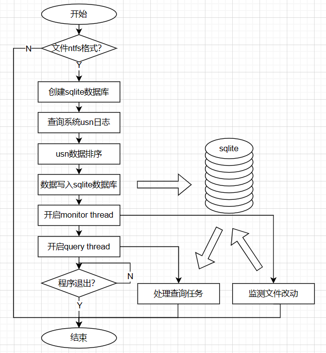

# MiniThing

#### 1. 介绍
- Windows平台的Everything文件查找速度非常快，优势在于利用了NTFS的USN日志，以及Windows上的文件监测机制
- 这个项目仿照类似原理，通过查询USN日志、监测Windows平台文件修改、使用SQLite数据库存储文件节点，并提供文件信息查询功能

#### 2. 如何使用
##### 2.1 编译
- Visual Studio：打开根目录下的MiniThing.sln，编译选择Build Solution，启动选择Local Windows Debugger
- CMake：待添加
##### 2.2 使用
- 目前仅支持命令行查找，程序启动后，输入要查询的盘符（eg."F:"）
- 第1次进入会建数据库，等待数据库建好之后，就能输入文件名进行查找

- 盘符下的文件改动也会被软件捕获到

- QT界面制作中...
- 正则查找等其他功能制作中...

#### 3. 编写计划
- [x] 实现基本的USN日志查询，建立初始的文件节点数据库，存放在unordered map中
- [x] 开启monitor thread，后台监测文件改动
- [x] 研究unicode规范，解决代码中宽字符的处理问题
- [ ] 添加开源的日志打印，或者自写轻量级的打印宏
- [x] 研究sqlite接口，将数据库完全port到sqlite中
- [x] 开启query thread，实现命令行查询
- [x] 开启task thread，加速文件节点排序、sqlite初始化
- [ ] ~~开启update thread，文件节点排序放到后台，加速进入软件~~
- [ ] 基本bug清掉，代码结构优化
- [ ] 调查MFC、QT，选一个实现ui界面
- [ ] 整理输出相关文档

#### 4. 性能测试
- 性能瓶颈主要集中在2方面：
- 1. 文件节点排序：从usn日志读取文件节点，存储在unordered map中，存取速度快。但排序需要进递归函数，这里采用了***多线程加速***
- 2. sqlite存数据：***sqlite采用了一些insert加速方法***
- 测试条件：cpu：intel i5-7200u，内存：8g，闪迪ssd固态硬盘
- 实测数据：`472,276`个文件节点，建sqlite数据库耗时`23.9014 S`（排序仅耗时`0.505526 S`，其余为sqlite insert），单次查询耗时`0.100215 S`
- 总结：sqlite insert过程还有优化空间，测试用的cpu太老性能也有所限制

#### 5. 已知bugs
- ~~query thread没有设置退出消息~~
- ~~删除目录文件时，目录中的文件节点，并没有在数据库中删除~~
- ~~重命名文件夹时，文件夹下的文件信息未更新~~

#### 6. 参与贡献
- Fork 本仓库
- 新建 Feat_xxx 分支
- 提交代码
- 新建 Pull Request