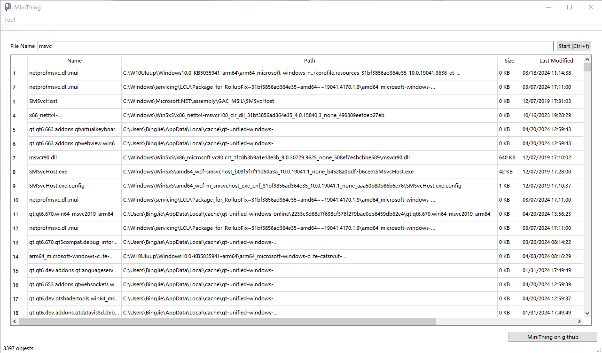

# MiniThing

## 1. Usage

- Enter file name in `search box`, `ctrl + f` or click `search button` to start

## 2. Build
- Enviroment: Visual Studio 2022 + QT 5.14.2

## 3. To be added
- Display more file info
- Perfermance enhance
- Fix bugs
- CMake build
- Graceful Qt UI

## 4. Participate in contributing
- Fork this repository
- Create a new Feature_xxx branch
- Submit the code
- Create a new pull request