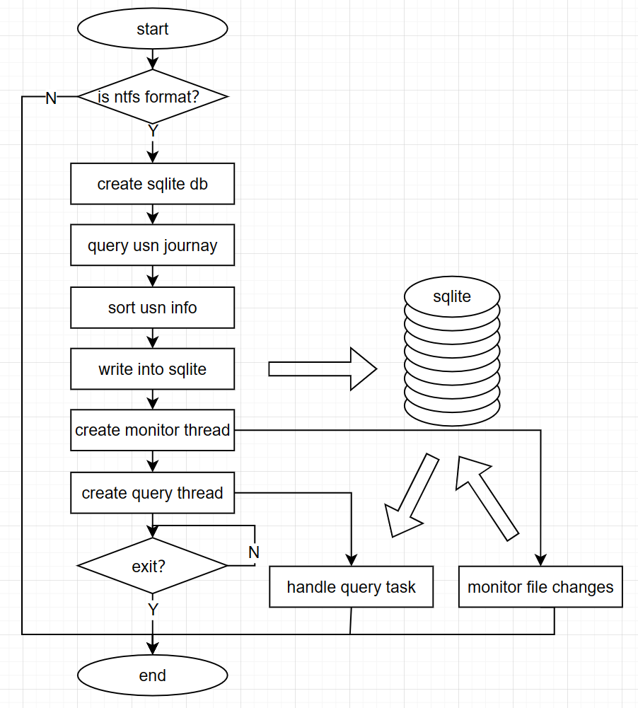

# MiniThing

！[Chinese Version](./README.ch.md)

## 1. Introduction
- The Everything software on Windows is very fast in file location, with the advantage of utilizing NTFS's USN logs and the file monitoring mechanism on Windows
- This project follows a similar principle by querying USN logs, monitoring Windows platform file changes, using sqlite databases to store file nodes, and providing file searching

## 2. How to use

### 2.1 Compile
- [x] Visual Studio
- [ ] CMake: To be added

### 2.2 Usage
- ***When debugging or using, run with administrator privileges***
- ***Now only support command line***
- 1. It will take a while to build the database for the first time
- 2. Enter the file name for searching
- 3. File change will also be captured
- 4. QT interface in preparing ...
- 5. Regular lookup and other complex functions in preparing ...

## 3. Performance parameters
- Performance bottlenecks are mainly concentrated in 2 aspects:
- 1. File node sorting: query file nodes from USN logs and store them in the unordered map. Sorting those file nodes requires recursive functions, so multithreaded acceleration is used here
- 2. Sqlite insert speed: sqlite uses some acceleration methods
- Test conditions: CPU: Intel i5-7200U, memory: 8G, disk: SanDisk SSD
- Measured data: `472,276` file nodes, it takes `23.9014 S` to build a sqlite database (it only takes `0.505526 S` for sorting, and the rest for sqlite inserting), and `0.100215 S` for a single query
- Summary: There is still room for optimization in the sqlite insert process, and the CPU of i5-7200U is also too old

## 4. Participate in contributing
- Fork this repository
- Create a new Feature_xxx branch
- Submit the code
- Create a new pull request